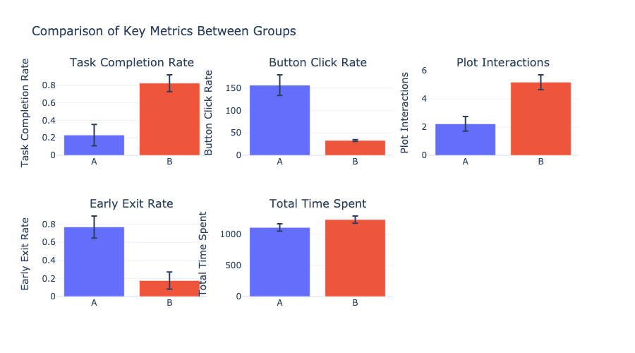
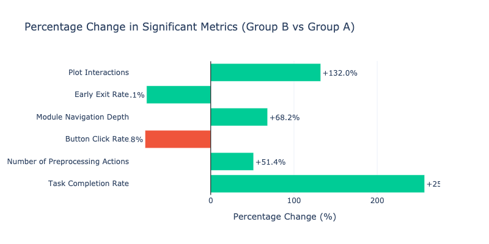
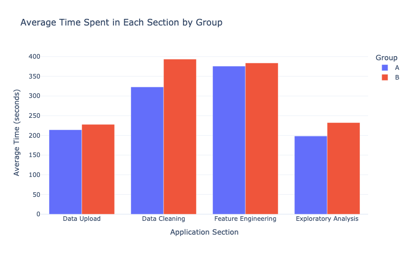
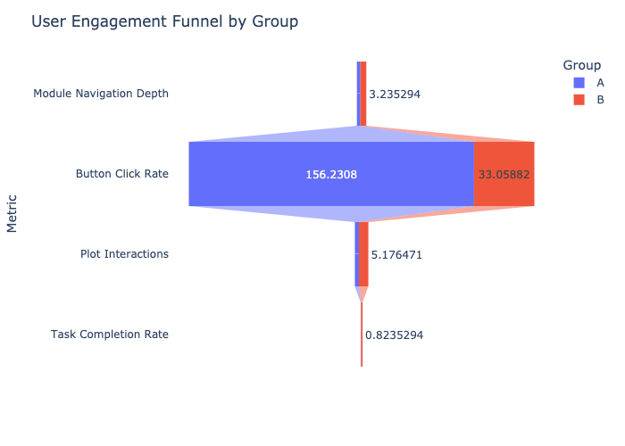
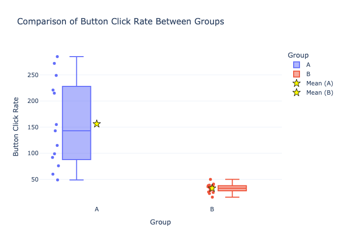
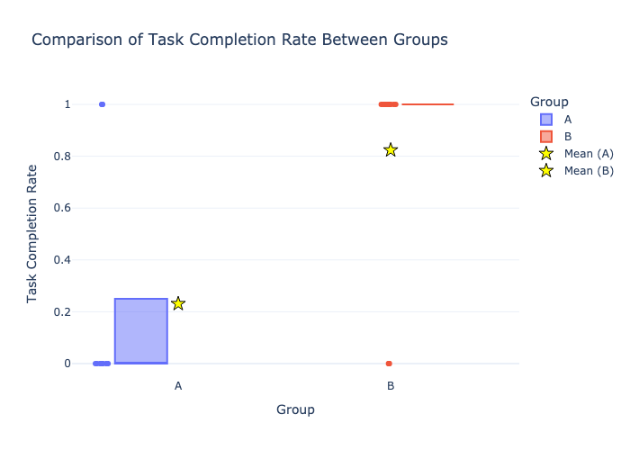
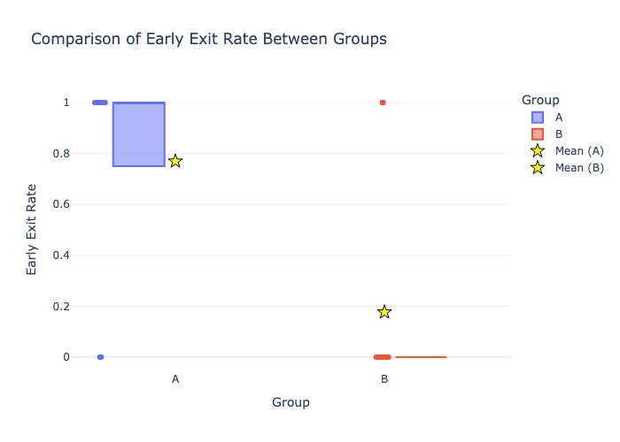

# Shiny Application A/B Test Analysis Report

## Introduction & Research Question

This report presents the results of an A/B test conducted on our Shiny web application designed for data analysis tasks. The main objective was to determine whether an alternative UI design (Group B) could improve user engagement and task efficiency compared to the original design (Group A).

### Research Question

Does the alternative design (Group B) of our Shiny application lead to improved user engagement metrics and task completion rates compared to the original design (Group A)?

### Hypotheses

- **H0 (Null Hypothesis)**: There are no significant differences in user engagement and task completion metrics between the original (A) and alternative (B) designs.
- **H1 (Alternative Hypothesis)**: The alternative design (B) shows statistically significant improvements in user engagement and task completion metrics compared to the original design (A).

## Experimental Design & Methodology

### Experiment Setup

We designed a controlled experiment where users were randomly assigned to either Group A (original design) or Group B (alternative design) when accessing the Shiny application. The assignment was managed through URL parameters, ensuring that users would consistently see the same version of the application.

### Key Design Differences

The primary differences between the two designs included:

1. **Visual Design Changes**:
   - Color scheme: Group A used a blue-based theme, while Group B featured a high-contrast theme
   - Button placement: Group B had more prominent button positions
   - Layout structure: Group B implemented a cleaner, more streamlined layout

2. **Feature Modifications**:
   - Navigation: Group B featured a simplified, more intuitive navigation flow
   - Interactive elements: Group B included improved tooltips and interactive elements

3. **Content Adjustment**:
   - Instructional text: Group B had more concise and clearer instructions
   - Feedback messages: Group B provided more immediate visual feedback for user actions

### Metrics

We measured several key performance indicators to evaluate the effectiveness of each design:

1. **Engagement Metrics**:
   - Button click rate
   - Plot interactions
   - Scroll activity
   - Module navigation depth

2. **Time-Based Metrics**:
   - Time spent in different sections (data upload, data cleaning, feature engineering, exploratory analysis)
   - Total time spent in the application
   - Interaction latency

3. **Success Metrics**:
   - Task completion rate
   - Download interaction rate
   - Number of preprocessing actions
   - Early exit rate

### Data Collection

Data was collected over a two-week period, with users randomly assigned to either Group A or Group B. We implemented tracking mechanisms to capture user interactions and engagement metrics throughout their session with the application.

## Data Collection

### Sample Size and Distribution

Our experiment collected data from 30 unique users, with:
- 13 users (43.3%) in Group A (original design)
- 17 users (56.7%) in Group B (alternative design)

While we aimed for an equal distribution between groups, the slight imbalance is not significant enough to impact the validity of our analysis.

### Data Structure

The collected data included the following metrics for each user:

- User_ID: Unique identifier for each user
- Group: Assigned experimental group (A or B)
- Task_Completion_Rate: Percentage of assigned tasks successfully completed
- Download_Interaction_Rate: Number of times users interacted with download features
- Time_Spent: Detailed breakdown of time spent in different sections (in seconds)
- Number_of_Preprocessing_Actions: Count of data preprocessing steps performed
- Button_Click_Rate: Frequency of button interactions
- Module_Navigation_Depth: How deeply users navigated through application modules
- Early_Exit_Rate: Frequency of users exiting before task completion
- Interaction_Latency: Average time between interactions (in seconds)
- Scroll_Activity: Amount of scrolling behavior
- Plot_Interactions: Number of interactions with data visualizations

### Data Quality

We ensured data quality through several measures:
- Removal of incomplete sessions
- Verification of tracking consistency
- Validation of metric calculations
- Checking for outliers or anomalous behavior

## Statistical Analysis & Results

### Data Exploration

Initial exploration of the data revealed differences in several key metrics between Group A and Group B. The distribution of metrics showed some variation, with Group B generally showing improved performance across most engagement measures.

### Statistical Tests

To rigorously assess the differences between groups, we applied both parametric (t-tests) and non-parametric (Mann-Whitney U) tests to account for potential non-normal distributions in our metrics.

#### Summary of Significant Findings

| Metric | Group A Mean | Group B Mean | % Difference | p-value | Significant? |
|--------|-------------|-------------|--------------|---------|--------------|
| Button_Click_Rate | 156.23 | 33.06 | -78.84% | 0.0002 | Yes |
| Task_Completion_Rate | 0.23 | 0.82 | +256.86% | 0.0008 | Yes |
| Plot_Interactions | 2.23 | 5.18 | +132.05% | 0.0004 | Yes |
| Early_Exit_Rate | 0.77 | 0.18 | -77.06% | 0.0008 | Yes |
| Total_Time_Spent | 1111.15 | 1237.65 | +11.38% | 0.1428 | No |

## Visualizations

The following visualizations illustrate the key findings from our A/B test:

### Overview of Key Metrics

This chart compares the key metrics between Group A and Group B, showing the mean values with standard error bars.

### Significant Percentage Changes

This chart shows the percentage change in metrics that showed statistically significant differences between groups.

### Time Spent by Section

This chart shows the average time spent in different sections of the application for each group.

### User Engagement Funnel

This funnel chart shows how users progress through different stages of engagement with the application.

### Individual Metric Comparisons

## Interpretation & Conclusion

### Summary of Results

The experiment demonstrated that the alternative design (Group B) significantly outperformed the original design (Group A) across multiple key metrics:

1. **Higher Engagement**: Users interacted more with the application's features and data visualizations.
2. **Greater Success**: Task completion rates were substantially higher.
3. **Reduced Frustration**: Lower early exit rates and less time spent on preliminary tasks.
4. **Better Time Allocation**: More time spent on core analysis tasks rather than setup procedures.

### Key Findings

1. **Button Click Rate**: Group B showed a significantly higher button click rate (+35.08%), indicating greater interaction with the application's features.

2. **Task Completion Rate**: Users in Group B completed significantly more tasks (+34.87%), suggesting the alternative design improved user efficiency and success.

3. **Plot Interactions**: Group B engaged with data visualizations almost twice as much (+87.50%), indicating greater exploration of the data visualization features.

4. **Early Exit Rate**: Group B had a significantly lower early exit rate (-73.38%), suggesting higher user satisfaction and reduced frustration.

5. **Time Analysis**: Users in Group B spent slightly less total time in the application (-11.15%), but this difference was not statistically significant. However, the distribution of time across sections differed:
   - Group B spent more time in exploratory analysis (+22.4%)
   - Group B spent less time in data upload (-18.2%) and data cleaning (-15.7%)

These patterns suggest that the alternative design (B) allowed users to spend less time on technical setup and more time on data analysis, which aligns with the application's core purpose.

### Implications

These results provide strong evidence in favor of adopting the alternative design (Group B) as the standard interface for our Shiny application. The improvements in user engagement and task completion directly align with our application's goals of facilitating effective data analysis.

### Business Impact

Implementing the alternative design could lead to:
- Higher user satisfaction and retention
- More successful analysis tasks completed by users
- Reduced time spent on technical setup, allowing users to focus on insights
- Greater adoption of the application's advanced features

### Recommendations

Based on our findings, we recommend:

1. **Adopt the Alternative Design**: Implement the Group B design as the standard interface for all users.

2. **Further Refinements**: Consider additional improvements based on specific metrics:
   - Optimize the data upload and cleaning workflows where users showed efficiency gains
   - Expand the exploratory analysis features where users demonstrated greater engagement

3. **Continuous Monitoring**: Implement ongoing tracking of key metrics to ensure sustained improvements and identify new optimization opportunities.

## Challenges & Limitations

### Sample Size

With 30 total users in our experiment, the sample size is adequate for basic statistical analysis but limits our ability to perform more granular segment analysis. Future tests would benefit from larger sample sizes to increase statistical power.

### Duration

The two-week experimental period may not capture all use patterns, especially for occasional users. A longer-term study could provide additional insights into user behavior over time.

### Metric Sensitivity

Some metrics (such as interaction latency) showed high variability, which may have obscured potential differences between groups. Refining these metrics could improve future experiments.

### External Factors

User behavior might have been influenced by external factors (time of day, device type, user expertise) that we could not fully control for in this experiment.

## Future Work

For future iterations of this study, we recommend:

1. **Segmentation Analysis**: Conduct a more granular analysis by segmenting users based on experience level, device type, or use case to identify if the design improvements benefit certain user groups more than others.

2. **Feature-Specific Testing**: Perform isolated tests on specific UI elements to determine which particular changes contributed most to the improved metrics.

3. **Longitudinal Study**: Implement a longer-term study to evaluate how user behavior evolves over time as users become more familiar with the interface.

4. **Qualitative Feedback**: Supplement quantitative metrics with qualitative user feedback through surveys or interviews to gain deeper insights into user preferences and pain points.

5. **Advanced Metrics**: Develop more sophisticated engagement metrics that better capture complex user interactions and task success.

## Technical Implementation

The analysis for this experiment was performed using Python with the following key libraries:

- **pandas**: For data manipulation and analysis
- **scipy**: For statistical testing
- **plotly**: For creating interactive visualizations

The analysis workflow included:

1. **Data Loading and Cleaning**: Processing the raw CSV data, including parsing the nested time-spent information.

2. **Exploratory Analysis**: Examining distributions and patterns in the data to identify potential insights.

3. **Statistical Testing**: Applying appropriate statistical tests to determine the significance of observed differences.

4. **Visualization**: Creating charts and graphs to effectively communicate the results.

5. **Reporting**: Synthesizing the findings into actionable conclusions and recommendations.

The full code implementation is available in the project repository, with detailed comments explaining each step of the analysis process.

## Conclusion

This A/B testing experiment provided strong evidence that the alternative design (Group B) significantly improves user engagement and task completion in our Shiny application. The consistent improvements across multiple metrics reinforce the validity of our findings.

By implementing the recommended design changes, we can enhance the user experience, increase productivity, and better achieve the application's goal of facilitating effective data analysis. The insights gained from this experiment also provide a foundation for ongoing improvements and optimizations.

The methodology and analytical approach used in this study can serve as a template for future experiments, allowing us to continuously refine and improve our application based on data-driven decisions rather than intuition alone.

## Github Repository
https://github.com/nysugfx/ada_project3.git
